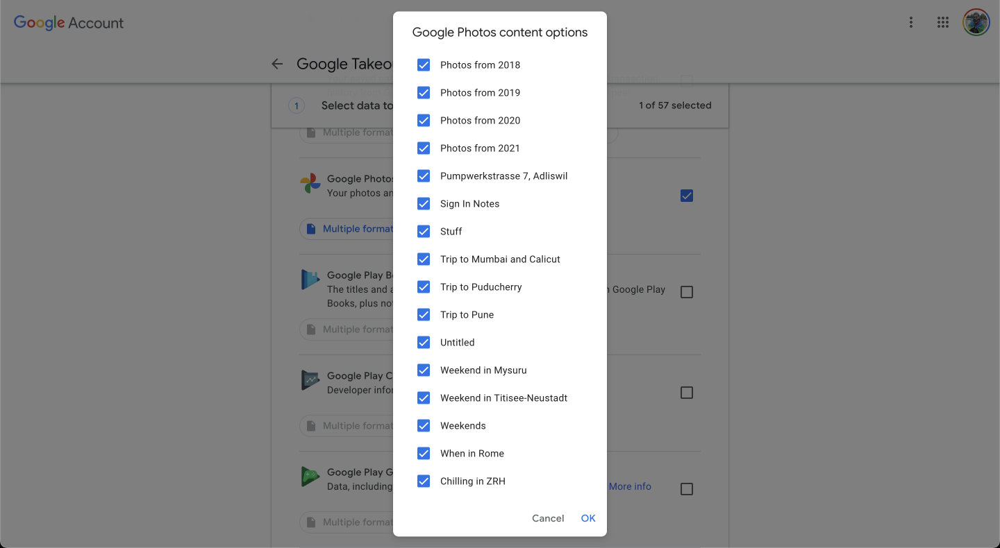
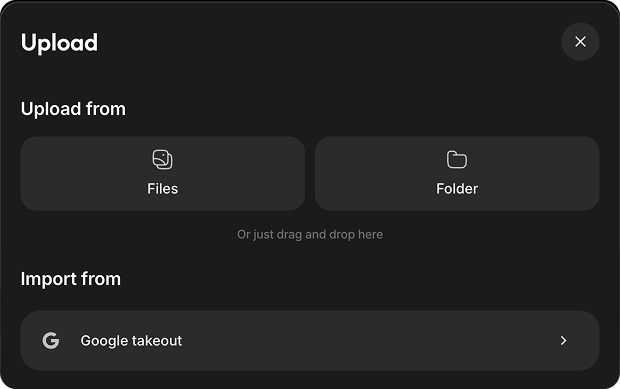
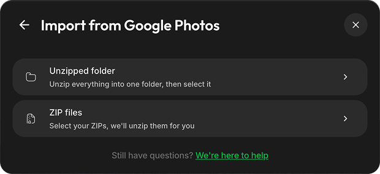
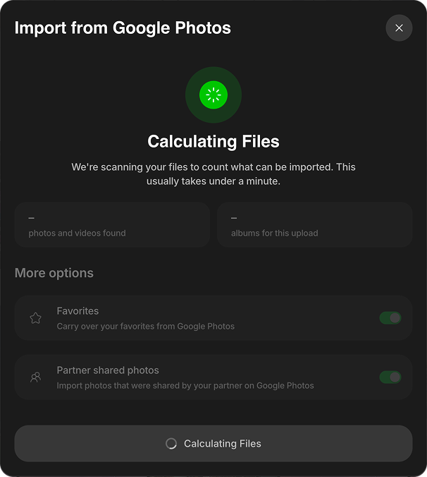
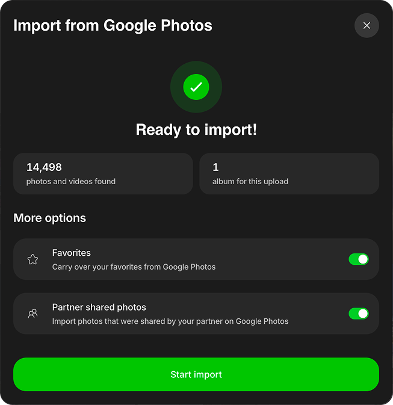
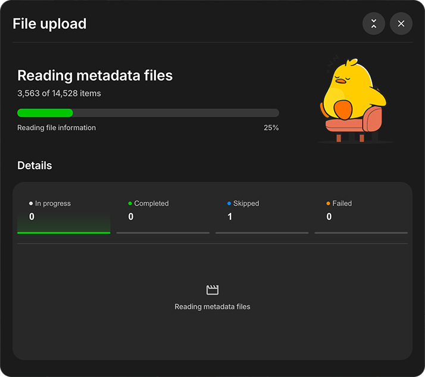

# Import from Google Photos

Follow these steps to recover your data from Google Photos and preserve it with Ente. Also, check the [Migration FAQ](/photos/faq/migration) for common questions.

### Steps

1. Open [takeout.google.com](https://takeout.google.com).

2. Click on "Deselect All" (since by default all Google services are selected).

    

3. Scroll down to find Google Photos in the list and select it by clicking the check box next to it.

    

4. Click on the button that says "All photo albums included".

5. Select the albums you want to export.

    

6. Scroll down and click on "Next Step".

    

7. Select "Frequency" and "File size" depending on the amount of storage on your system and click on "Create export". Make sure you select ZIP as the format.

    

8. Wait for Google to send you your data.

9. Open [the Ente desktop app](https://ente.com/download/desktop), click **Upload**, and select **Google takeout**.

    

10. Choose how to select the Takeout:
    - **Unzipped folder (recommended)**: If you have multiple ZIP files, extract them all into one parent folder first. Keep the subfolders as-is instead of flattening everything into one folder. This gives Ente the best chance of matching each photo or video with its metadata. Learn more about [Google Takeout metadata](/photos/faq/metadata-and-editing#google-takeout-metadata).
    - **ZIP files**: Select the downloaded ZIP files directly and Ente will extract them. If Google split a media file and its metadata across different ZIPs, the metadata might not be matched correctly.

    

11. Choose where to import your photos:

    **If you selected a folder**, decide whether you want to:
    - **Import to existing album** → Pick one of your current albums, or
    - **Create new album(s)** → Click "Create albums", then:
        - If your folder has subfolders: Choose between "Separate albums" (each folder becomes its own album) or "Single album" (everything goes into one album)

            

        - If it's a single folder: Just name your new album

    **If you selected ZIP files directly**:
    - Photos are automatically organized into separate albums based on the folder structure within the ZIPs

12. Wait while Ente scans the selected files. The **Calculating Files** screen remains visible while Ente counts importable media and albums.

    

13. Review the import summary:
    - The first total combines the photos and videos found.
    - The second total shows how many albums will be created or updated.
    - **Favorites** is enabled by default. Keep it enabled to add items marked as favorites in Google Photos to Ente's Favorites album.
    - **Partner shared photos** is enabled by default. Disable it when the original owner is also importing their library and you want to avoid duplicate copies. Excluded items appear under **Skipped** with the reason **Shared by partner**.

    

14. Click **Start import**. The upload begins as a compact progress card in the bottom-right corner. Expand it to view the current phase and the **In progress**, **Completed**, **Skipped**, and **Failed** sections.

    

    Ente reads the JSON metadata sidecar files included in the Takeout before uploading the associated photos and videos.

    

    Learn more about stopping an upload, reviewing skipped or failed items, and retrying failures in [Import from Local Hard Disk](/photos/migration/from-local-hard-disk).

Ente will parse Google's metadata and preserve everything with your photos, end-to-end encrypted!

---

In case your uploads get interrupted, just drag and drop the folder or files again. Ente will automatically ignore already backed up files and upload just the rest.

If you run into any issues during this migration, please check out our [Migration FAQ](/photos/faq/migration#importing-from-google-photos) page or reach out to [support@ente.com](mailto:support@ente.com) and we will be happy to help you!

> [!TIP]
>
> In case you wish to use face recognition and other advanced search features provided by Ente, we recommend that you enable [machine learning](/photos/features/search-and-discovery/machine-learning) before importing your photos so that the Ente app can directly index files as they are getting uploaded.
