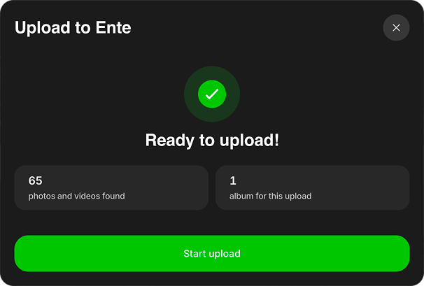
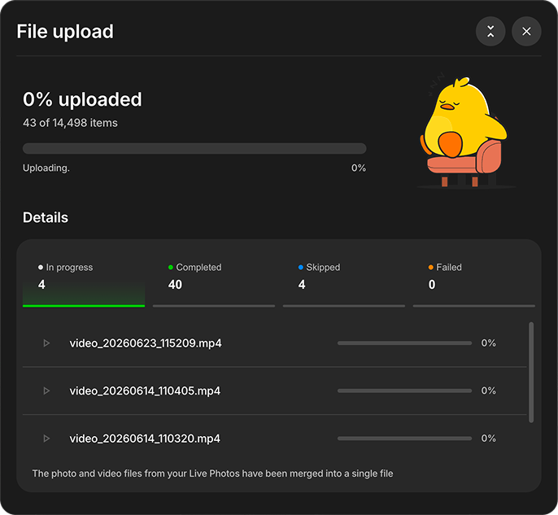
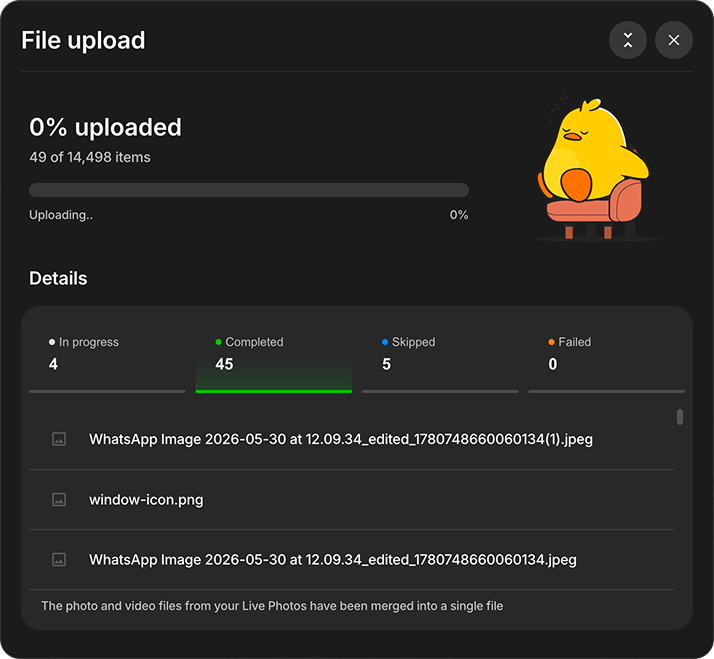
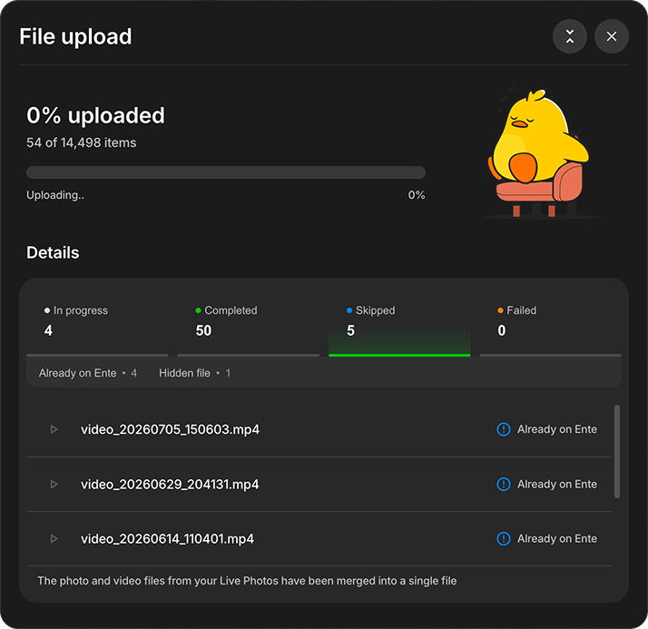
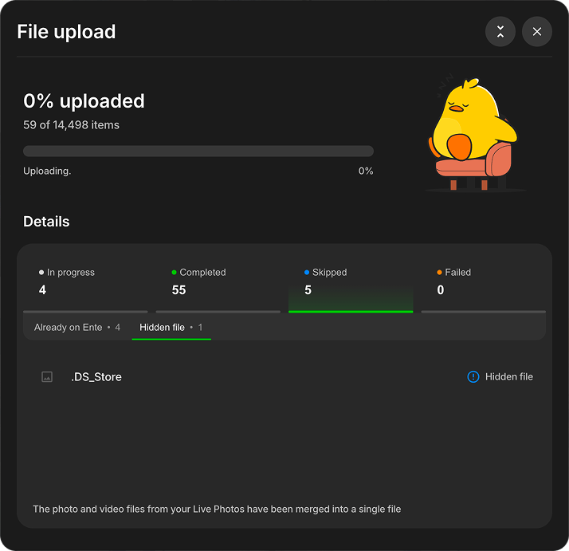
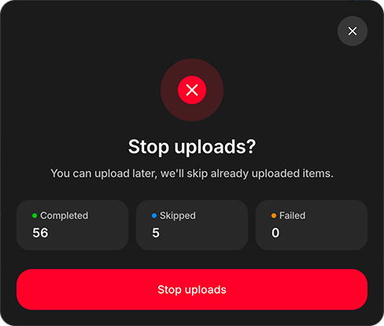
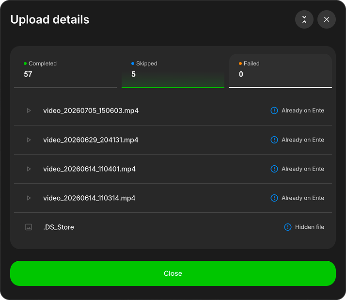
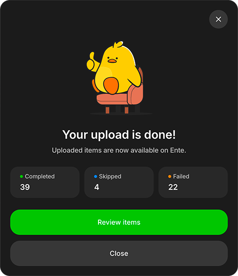
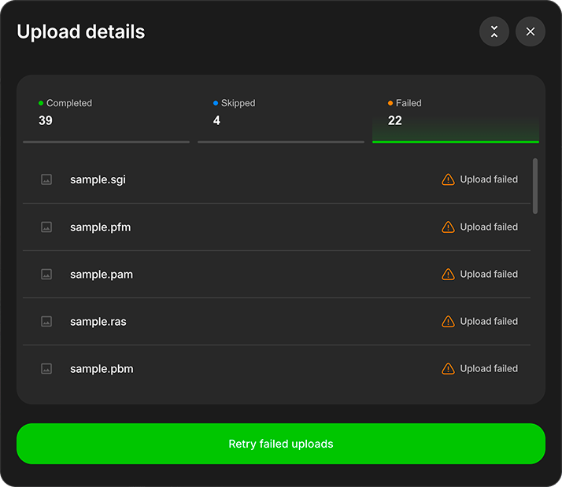

# Upload photos from your computer

Use the Ente desktop app to upload photos and videos from your computer or an external drive.

## Start an upload

1. Download and install the [Ente desktop app](https://ente.com/download/desktop), then sign in.
2. Click **Upload** and select **Files** or **Folder**. You can also drag and drop files or folders into the app window.

    

3. Choose an album. For folders, choose one album or a separate album for each folder.
4. Review the media and album counts, then click **Start upload**.

    

> [!NOTE]
>
> A single file may skip this review. Google Takeout imports show it; [Watch Folder](/photos/features/backup-and-sync/watch-folders) uploads do not.

## Understanding folder structure options

When you upload a folder, Ente will ask how you want to organize your photos:

**Single album**: Creates one Ente album containing all files from all subfolders. Best for a collection where folder structure doesn't matter.

**Separate albums**: Creates a separate Ente album for each subfolder. Best for preserving your existing organization (e.g., "2023/Summer", "2023/Winter" become separate albums).

Learn more about [folder structure handling](/photos/features/albums-and-organization/albums#preserving-folder-structure).

## Follow upload progress

Uploads start as a compact card in the bottom-right corner. Expand it for details.

The expanded view opens on **In progress**.

Use the four sections to review the upload:

- **In progress**: Active files.
- **Completed**: Successfully uploaded files.
- **Skipped**: Files not uploaded, grouped by reason.
- **Failed**: Unsuccessful uploads.

### In-progress and completed files

Open **Completed** to see uploaded files.

### Skipped files

**Skipped** groups files by reasons such as **Already on Ente** and **Hidden file**.

Select a reason to filter the list.

Skipped files are not retryable failures.

## Stop and resume an upload

Close an active upload and confirm **Stop uploads**. Completed files remain in Ente and will be skipped if selected again.

After stopping, open a section to review its files.

To continue, select the same files or folders again. Ente uploads only the remaining items.

## Review a completed upload

When the upload finishes, click **Review items** to inspect skipped or failed files.

Open **Failed**, then click **Retry failed uploads** to try them again.

## Tips for large libraries

- **Start small**: Try uploading a small folder first to familiarize yourself with the process
- **Check your storage**: Ensure you have enough space in your Ente plan before starting large uploads
- **Stable connection**: Use a reliable internet connection, preferably wired Ethernet for very large libraries
- **Keep app open**: While the initial upload of multi-TB libraries may take hours or even days, the app will resume if interrupted
- **Resumable uploads**: If uploads get interrupted, select or drag and drop the same folders again. Ente skips already uploaded files and continues with the rest.

## Alternative: Watch Folders

Instead of a one-time upload, you can use [watch folders](/photos/features/backup-and-sync/watch-folders) to automatically sync folders on an ongoing basis. This is perfect for:

- Photo libraries you actively update
- Automated backup workflows
- Keeping Ente in sync with your local photo organization

## Troubleshooting

**Upload is slow**: Try disabling "Faster uploads" in `Settings > Preferences > Advanced` if you're having issues

**Large videos causing problems**: See the [large uploads troubleshooting guide](/photos/faq/troubleshooting#large-uploads)

**Files being skipped or failing**: Review the reason in **Upload details**, then check [Troubleshooting](/photos/faq/troubleshooting) for common solutions.

If you run into any issues during uploads, please reach out to [support@ente.com](mailto:support@ente.com) and we will be happy to help you!
